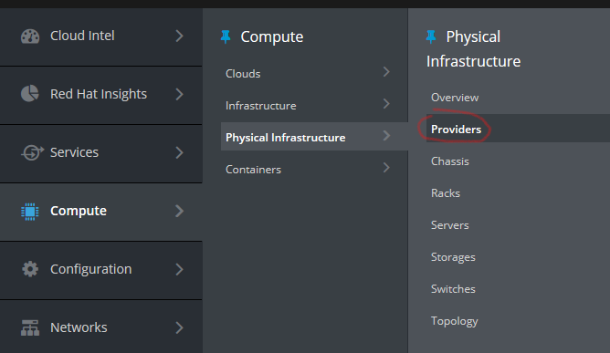
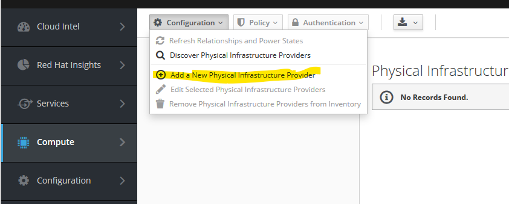
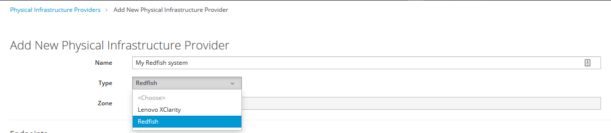
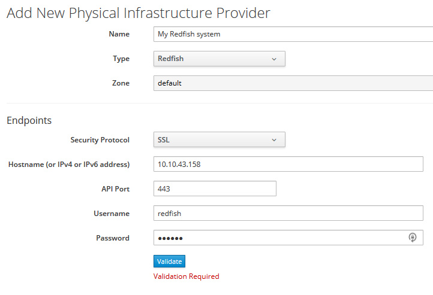
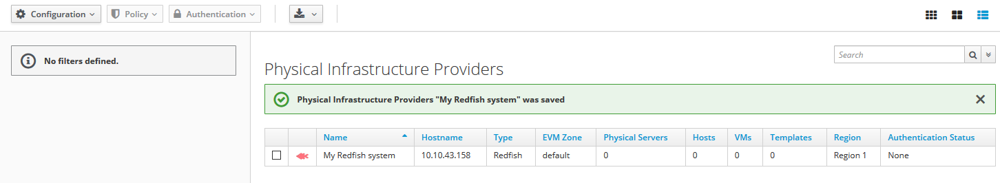

== Adding a new {redfish-provider-title} to {product-title}

This section describes how to add a new {redfish-provider} to {product-title}
using {product-gui}. First step is to log in. Then navigate to
*Compute -> Physical Infrastructure -> Providers* page from the main navigation
on the left.

In the *Configuration* drop-down, select *Add a New Physical Infrastructure
Provider*:

Type in the name of the new {redfish-provider} in the *Name* field and select
*Redfish* in the *Type* drop-down:

This will reveal fields to describe the endpoint of the new {redfish-provider-full}.
Populate them as needed:

To proceed, click *Validate*. If the credential validation was successful, click
*Add*. The Physical Infrastructure Providers list will display the new provider:

It takes about a minute before the inventory gets populated for the first time,
so use the browser's refresh function to obtain an updated status.